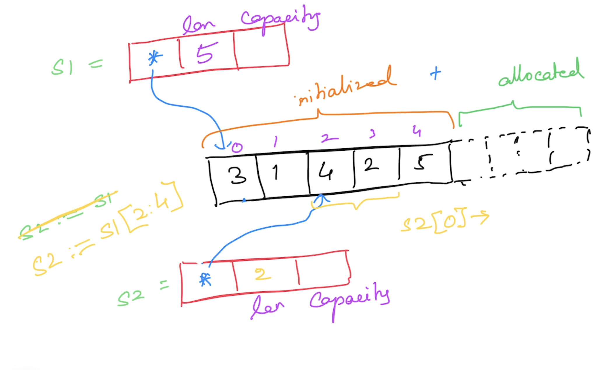

# Go Foundations

## Magesh Kuppan

## Schedule
- Commence      : 9:00 AM
- Tea Break     : 10:30 AM (20 mins)
- Lunch Break   : 12:30 PM (1 hr)
- Tea Break     : 3:00 PM (20 mins)
- Wind up       : 5:00 PM

## Methodology
- No powerpoint
- Discussion & Code

## Repository
- https://github.com/tkmagesh/Synechron-Go-Dec-2023

## Software Requirements
- Go Tools (https://go.dev/dl)
- Visual Studio Code (https://code.visualstudio.com)
- Go extension for VSCode (https://marketplace.visualstudio.com/items?itemName=golang.Go)

### Verification
> go version

## Who Go?
- Simplicity
    - ONLY 25 keywords
    - No access modifiers (No private/public/protected etc)
    - No classes (only structs)
    - No Inheritance (only composition)
    - No Reference types (everything is a value)
    - No pointer arithmatic
    - No exceptions (only errors)
    - No try..catch..finally
    - No implicit type conversion
- Performance
    - Equivalent to C++
- Close to hardware
    - Application builds targeting each OS
    - No VM (JVM, CLR)
    - No JIT
    - Tooling support for cross compilation
- Managed Concurrency
    - Concurrency is NOT parallelism
    - Ability to have more than one execution path
    - Concurrent Operations are represented as Goroutines
    - Goroutines are cheap (4 KB / goroutine)
    - Builtin scheduler to schedule & manage the goroutines
    - Support for concurrency built in the language
        - go keyword, channel (data type), channel operator ( <- ), range & select-case constructs
    - API support
        - "sync" packages
        - "sync/atomic" packages
### Concurrency Model (Using OS Threads)

### Concurrency Model (Using Goroutines)

## Go Program Basics
- To run a go file
    > go run [file_name.go]
- To create a build
    - > go build [file_name.go]
    - > go build -o [binary_name] [file_name.go]
## Cross Compilation
- To get the list of env variables used by the go tool
    - > go env
    - > go env [var_1] [var_2] ....
- Environment variables for cross compilation (GOOS, GOARCH)
- To get the list of support platforms (valid values for GOOS & GOARCH)
    > go tool dist list
- To change the environment variables
    - go env -w [var_1]=[value_1] [var_2]=[value_2]
    - ex:
        - > go env -w GOOS=windows GOARCH=386
## Data Types
- string
- bool
- integer types
    - int8
    - int16
    - int32
    - int64
    - int
- unsigned integer types
    - uint8
    - uint16
    - uint32
    - uint64
    - uint
- floating type
    - float32
    - float64
- complex types
    - complex64 (real[float32] + imaginary[float32])
    - complex128 (real[float64] + imaginary[float64])
- type alias
    - byte (alias for uint8)
    - rune (alias for int32) (unicode code point)

## Variables & Constants
    - variables declared using "var" keyword or ":="
    - constants declared using "const" keyword
    - Function Scope
        - Cannot have unused variables
        - Can use ":="
        - Can have unused constants
    - Package Scope
        - Can have unused variables
        - Cannot use ":="
        - Can have unused constants

## iota (contant values auto generated)

## Functions
- Functions can return more than 1 result
- Support for variadic functions
- Anonymous functions
    - Functions inside other function
    - Cannot have any name
    - Has to be immediately invoked
- Higher Order Functions
    - Assign a function to a variable
    - Pass functions as arguments to other functions
    - Return functions as return values from other functions

## Errors
- Just values
- By convention, errors are object implementing "error" interface
    - Error() string
- Errors are not thrown but returned
- Creation
    - errors.New()
    - fmt.Errorf()

## Deferred Functions
- Functions whose execution is postponed until the current function execution is completed and returned

## Panic & Recovery
- Panic - The state of the application where the applcation execution cannot proceed any further
- Use panic() function to create a panic
- Use recover() function to get the error that resulted in the panic

## Collections
### Arrays
- Fixed sized typed collection
- len()
- Iterate using the "range" construct
### Slices
- Varying sized typed collection
- Essentialy a pointer to an underlying array
- len()
- append() to add new items to the slice
- cap() => memory initialized + memory allocated

### Map
- Typed collection of key/value pairs

## Modules & Packages
- Modules
    - Any code that need to be versioned & deployed together
    - Typically created for a whole application
    - folder with "go.mod" file
    - go.mod 
        - manifest for the application/module
        - contains
            - module name
            - Go runtime version 
            - dependencies info
        - how to create?
            - > go mod init [module_name]
            - module_name = advisable to have the complete repo path as the module name
    - to run a module
        - > go run .
    - to build a module
        - > go build .
        - > go build -o [binary_name] .
- Package
    - internal organization of a module
    - Typically folders
    - All the code in all the files under a package folder are considered to be belonging to that package
    - Types with name starting with Uppercase are public to the package
    - Types with name starting with lowercase are private to the package
- 3rd party modules
    - install
        > go get [module_name]
        - by default downloaded in the $GOPATH/pkg/mod folder
    - To update 3rd party module references in the go.mod file based on their usage in the application code
        > go mod tidy
    - To download the dependencies documented in the go.mod file
        > go mod download
    - To display the list of dependencies
        > go list -m "all"
    - To display the dependency graph
        > go mod graph
    - To display the dependency graph of one module
        > go mod why [module_name]
    - To install a go module as a binary (command line tool)
        > go install [module_name]
        - by default downloaded & build created in the $GOPATH/bin folder
    - Reference: https://go.dev/ref/mod
